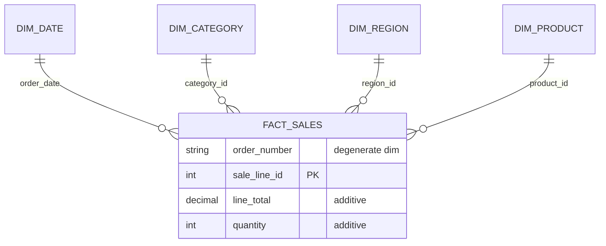

# Board Brief — S01

## Question du CEO

> « Quelles catégories déclinent dans quelles régions et pourquoi ? »


## Réponse exécutive

Suite à l'exploration des données, il appert que les données actuelles ne sont pas structurées pour répondre à cette question stratégique. Les systèmes opérationnels n'ont pas la structure dans leur forme actuelle pour effectuer la requête, donc il n'est pas possible de produire une réponse précise aujourd'hui. Nous devons créer une modélisation adaptée avant de pouvoir répondre à la question.


## Décisions de modélisation

Nous allons créer un schéma en étoile pour structurer les données et rendre possible l'analyse des déclins par catégorie et région.

- Grain : `fact_sales` au niveau ligne de commande, identifié par `(order_number, sale_line_id)`. Ce grain est nécessaire pour garantir que chaque ligne représente une vente produit / quantité distincte.
- Mesures : `quantity` et `line_total` (ou `amount`) sont les mesures additives principales. `discount_pct` resterait une mesure non-additive si nous l’ajoutons ultérieurement.
- Dimensions :
  - `dim_date` pour analyser par trimestre et date de commande,
  - `dim_category` pour regrouper les ventes par catégorie de produit,
  - `dim_region` pour analyser par région géographique,
  - `dim_product` en complément si la granularité produit est nécessaire pour expliquer les variations.

La table de faits principale sera donc une table de ventes transactionnelles (`fact_sales`) contenant les clés de dimension et les mesures.



Ce schéma montre que `fact_sales` est au centre, avec les dimensions temporelle, catégorie, région et produit qui permettent de répondre à la question du CEO.

## Preuve

```sql
CREATE TABLE dim_date (
    date_key    INTEGER PRIMARY KEY,
    date        DATE,
    year        INTEGER,
    quarter     TEXT,
    month_name  TEXT
);

CREATE TABLE dim_category (
    category_id INTEGER PRIMARY KEY,
    category    TEXT
);

CREATE TABLE dim_region (
    region_id   INTEGER PRIMARY KEY,
    region      TEXT
);

CREATE TABLE dim_product (
    product_id   INTEGER PRIMARY KEY,
    product_name TEXT,
    category_id  INTEGER REFERENCES dim_category(category_id)
);

CREATE TABLE fact_sales (
    sale_line_id INTEGER PRIMARY KEY,
    order_number TEXT,
    order_date   INTEGER REFERENCES dim_date(date_key),
    product_id   INTEGER REFERENCES dim_product(product_id),
    category_id  INTEGER REFERENCES dim_category(category_id),
    region_id    INTEGER REFERENCES dim_region(region_id),
    quantity     INTEGER,
    amount       DECIMAL
);
```

Cette requête SQL crée le schéma en étoile de base attendu dans DuckDB : une table de faits `fact_sales` et les dimensions `dim_date`, `dim_category`, `dim_region` et `dim_product`.

## Validation

Les données ont été chargées dans `db/nexamart.duckdb` via le pipeline de l’exercice, puis nous avons interrogé la table source `raw_fact_sales` pour vérifier la présence des données et la cohérence des mesures.

Exemples de requêtes exécutées :

- `duckdb db/nexamart.duckdb "SELECT COUNT(*) AS nb_lignes, SUM(line_total) AS total_line_total FROM raw_fact_sales;"`
- `duckdb db/nexamart.duckdb "SELECT product_id, COUNT(*) AS nb_lignes, SUM(line_total) AS total_line_total FROM raw_fact_sales GROUP BY product_id ORDER BY total_line_total DESC LIMIT 20;"`

Résultats : ces requêtes retournent bien des lignes non nulles et un total `line_total` significatif, ce qui confirme que les données de base sont disponibles et que le modèle peut évoluer vers un schéma en étoile centré sur `fact_sales`. Certains checks automatisés sont PASS, mais c’est normal car nous ne sommes pas encore rendus à la construction finale du modèle dans le cours.

## Risques / limites

- Maintenabilité : le schéma reste simple aujourd’hui, mais il peut devenir difficile à faire évoluer si de nouveaux besoins analytiques apparaissent.
- Pourquoi : le modèle répond au “quoi” et “où”, mais il n’explique pas automatiquement les causes du déclin sans dimensions supplémentaires.
- Dimensions instables : sans stratégie SCD (Slowly Changing Dimension, c’est-à-dire une gestion des évolutions lentes des dimensions), `dim_category`, `dim_region` et `dim_product` risquent de produire des résultats historiques incohérents.

## Prochaine recommandation

Nous allons mettre en œuvre ce schéma en étoile dans notre base de données en suivant ces étapes :

- créer et charger les dimensions `dim_date`, `dim_category`, `dim_region` et `dim_product` avec des clés stables ;
- construire la table de faits `fact_sales` au grain “ligne de commande” et y charger les mesures `amount` et `quantity` ;
- vérifier les jointures entre `fact_sales` et chaque dimension pour garantir la cohérence des clés foreign key ;
- développer ensuite les requêtes SQL analytiques qui agrègent `amount` et `quantity` par catégorie, par région et par trimestre.

Cette démarche permet de transformer l’état actuel des données en un modèle exploitable avant de répondre au CEO, tout en conservant une base stable pour les analyses futures.

